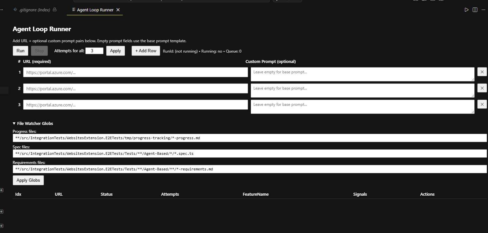

# Agent Loop Runner

A VS Code extension that orchestrates AI agent runs over a list of URLs — each URL gets a fresh chat session, a generated prompt, and automated status tracking. Designed for batch-running Copilot custom agents (e.g., Playwright test generation) across multiple pages unattended.



## Features

- **Batch URL processing** — queue up multiple URLs, each gets its own chat session and prompt
- **Per-job custom prompts** — override the base prompt template for individual URLs
- **Automatic retry** — configurable max attempts per URL with retry context carried forward
- **Live status tracking** — file system watchers detect agent-created progress files, spec files, requirements docs, and status markers in real time
- **Configurable file watchers** — glob patterns for all watched file types are editable in the UI and settings
- **Per-job timeout** — optional safety net for unattended runs
- **Cancel/stop controls** — cancel individual jobs or stop the entire queue

## How It Works

1. You provide a list of URLs (and optional per-URL custom prompts) in the webview panel
2. For each URL, the extension:
   - Generates a prompt file at `.agent-loop/prompts/<runId>/<index>.prompt.md` using the built-in default prompt (or a custom prompt entered in the UI) with injected metadata headers (`RunId`, `Item`, `URL`, `Attempt`, `MaxLoopsPerUrl`)
   - Opens a new VS Code chat session with the configured agent (via `mode` parameter)
   - Auto-submits the prompt
3. The extension watches for a `.agent-loop/status/<runId>/<index>.status.md` file written by the agent containing `AGENT_STATUS: PASS` or `AGENT_STATUS: FAIL`
4. On PASS → marks the job done and moves to the next URL
5. On FAIL → retries up to the configured max attempts, appending previous-attempt context to help the agent recover

## Getting Started

### Option 1: Develop the Extension (F5)

Clone the repo, install dependencies, and launch the Extension Development Host:

```bash
git clone https://github.com/StewartMckenzie/agent-loop-runner.git
cd agent-loop-runner
npm install
```

1. Open the folder in VS Code
2. Press **F5** — this compiles the TypeScript source and opens a new VS Code window with the extension loaded
3. In the new window, open the Command Palette (`Ctrl+Shift+P`) and run **Agent Loop Runner: Open**
4. Enter URLs, adjust settings, and click **Run**

> The launch configuration is pre-configured in `.vscode/launch.json` with a `compile` pre-launch task, so source changes are compiled automatically on each F5 launch.

### Option 2: Install from VSIX

If you just want to **use** the extension without working on the source:

1. Download the latest `.vsix` from [GitHub Releases](https://github.com/StewartMckenzie/agent-loop-runner/releases)
2. Install in VS Code using one of these methods:
   - **Command line:**
     ```bash
     code --install-extension agent-loop-runner-0.0.1.vsix
     ```
   - **VS Code UI:** Open the **Extensions** sidebar → click the `⋯` menu → **Install from VSIX…** → select the `.vsix` file
3. Reload VS Code when prompted (or run **Developer: Reload Window** from the Command Palette)
4. Open the Command Palette (`Ctrl+Shift+P`) and run **Agent Loop Runner: Open**

### Build VSIX from Source

To package a `.vsix` yourself:

```bash
npm install
npm run compile
npx @vscode/vsce package
```

This produces `agent-loop-runner-<version>.vsix` in the project root, which you can install with the steps above.

## Settings

All settings are under `agentLoopRunner.*` and can also be set in workspace `.vscode/settings.json`.

| Setting | Default | Description |
|---------|---------|-------------|
| `maxLoopsPerUrl` | `3` | Max retry attempts per URL (1–20) |
| `featureMapWindowMs` | `120000` | Window (ms) to map newly created progress files to the most recent unmapped running job |
| `agentName` | `PlaywrightLoopPlanning` | Name of the chat agent to route prompts to (must match a `.github/agents/<name>.agent.md` file) |
| `perJobTimeoutMs` | `0` | Max ms to wait for a job's status file. 0 = no timeout. Recommended: `1800000` (30 min) |
| `progressGlob` | `**/src/IntegrationTests/.../*-progress.md` | Glob pattern for agent progress files |
| `specGlob` | `**/.../*/*.spec.ts` | Glob pattern for generated spec files |
| `requirementsGlob` | `**/.../.../*-requirements.md` | Glob pattern for generated requirements files |

The glob settings can also be changed directly in the **File Watcher Globs** section of the UI panel.

## Prompt

The extension ships with a built-in default prompt. You can override it per-URL by typing a custom prompt in the UI's prompt column. When no custom prompt is provided, the built-in default is used.

Every prompt (default or custom) is wrapped with metadata headers before submission:

```
RunId: <unique run id>
Item: <job index, e.g. 001>
URL: <target URL>
Attempt: <current attempt number>
MaxLoopsPerUrl: <max retries>
```

If your custom prompt includes `{{URL}}`, `{{RunId}}`, `{{Item}}`, `{{Attempt}}`, or `{{MaxLoopsPerUrl}}` tokens, they will be replaced with the actual values.

The built-in default prompt can be found in [`examples/prompts/basePrompt.md`](examples/prompts/basePrompt.md) for reference.

## Status File Protocol

The agent must write a status file to `.agent-loop/status/<RunId>/<Item>.status.md` with at least:

```
AGENT_STATUS: PASS
FeatureName: <name>
Timestamp: <iso>
Summary: <text>
SpecPath: <path>
```

Or on failure:

```
AGENT_STATUS: FAIL
FeatureName: <name>
Timestamp: <iso>
Summary: <text>
Reason: <cause>
```

## How Agents Communicate with the Orchestrator

The Agent Loop Runner uses **file system watchers** to track agent progress in real time. Agents don't call back into the extension directly — instead, they write files to specific paths that match configurable glob patterns. The extension watches those paths and updates the UI automatically.

### Artifact Flow Diagram

```
┌─────────────────────────────────────────────────────────────────────────┐
│                        Agent Loop Runner Extension                      │
│                                                                         │
│  1. Writes prompt to:                                                   │
│     .agent-loop/prompts/<RunId>/<Item>.prompt.md                        │
│                                                                         │
│  2. Opens VS Code chat with the configured agent                        │
│                                                                         │
│  3. Watches for file system events... ──────────────────────┐           │
│                                                              │           │
│  ┌──────────────────────────────────────────────────────────┐│           │
│  │  File Watchers (glob patterns)                           ││           │
│  │                                                          ││           │
│  │  progressGlob ──► maps feature to active job             ││           │
│  │  specGlob     ──► links spec artifact to job             ││           │
│  │  reqGlob      ──► links requirements doc to job          ││           │
│  │  statusGlob   ──► resolves job as PASS/FAIL              ││           │
│  └──────────────────────────────────────────────────────────┘│           │
│                                                              │           │
│  4. On PASS → marks job done, advances queue                 │           │
│  5. On FAIL → retries with context from previous attempt     │           │
└─────────────────────────────────────────────────────────────────────────┘

                              ▲ watches files
                              │
        ┌─────────────────────┴────────────────────────┐
        │              Agent (in Copilot Chat)          │
        │                                               │
        │  Writes artifacts to disk as it works:        │
        │                                               │
        │  ① Progress file   → detected by progressGlob│
        │  ② Requirements doc → detected by reqGlob     │
        │  ③ Spec file       → detected by specGlob     │
        │  ④ Status file     → detected by statusGlob   │
        └───────────────────────────────────────────────┘
```

### The Four Watched Globs

Each glob maps to a watcher in the extension. When a matching file is created or modified, the extension updates the corresponding job.

#### 1. Progress Glob (`progressGlob`)

**Default**: `**/src/IntegrationTests/WebsitesExtension.E2ETests/tmp/progress-tracking/*-progress.md`

**What it does**: When the agent creates `{FeatureName}-progress.md`, the extension extracts the feature name from the filename (e.g., `CORS-progress.md` → `CORS`) and maps it to the most recently started unmapped job. This is how the extension knows *which* job the agent is working on.

**Written by**: PlaywrightLoopPlanning agent (the orchestrator agent) — it creates and incrementally appends to this file across its planning phases.

**Example path**: `src/IntegrationTests/WebsitesExtension.E2ETests/tmp/progress-tracking/CORS-progress.md`

#### 2. Spec Glob (`specGlob`)

**Default**: `**/src/IntegrationTests/WebsitesExtension.E2ETests/Tests/**/Agent-Based/*/*.spec.ts`

**What it does**: Links the generated test spec to the active job. The extension extracts the feature name from `{FeatureName}.spec.ts` and associates it with the job via the `featureToJob` mapping established by the progress watcher.

**Written by**: PlaywrightLoopCoding agent (invoked as a subagent by PlaywrightLoopPlanning).

**Example path**: `src/IntegrationTests/WebsitesExtension.E2ETests/Tests/AppService/PostCreate/Agent-Based/CORS/CORS.spec.ts`

#### 3. Requirements Glob (`requirementsGlob`)

**Default**: `**/src/IntegrationTests/WebsitesExtension.E2ETests/Tests/**/Agent-Based/**/*-requirements.md`

**What it does**: Links the requirements document to the active job. Similar to the spec watcher, the feature name is extracted from `{FeatureName}-requirements.md`.

**Written by**: PlaywrightLoopPlanning agent — creates this during its finalization phase summarizing all validated test requirements.

**Example path**: `src/IntegrationTests/WebsitesExtension.E2ETests/Tests/AppService/PostCreate/Agent-Based/CORS/CORS-requirements.md`

#### 4. Status Glob (hardcoded)

**Pattern**: `**/.agent-loop/status/**/*.status.md`

**What it does**: This is the **completion signal**. The extension matches the `<Item>` from the filename (e.g., `001.status.md`) to the corresponding job index and reads `AGENT_STATUS: PASS` or `AGENT_STATUS: FAIL` from the file contents. A PASS resolves the job; a FAIL triggers a retry (up to `maxLoopsPerUrl`).

**Written by**: PlaywrightLoopCoding agent — writes this as its final action after test execution succeeds or all retries are exhausted.

**Example path**: `.agent-loop/status/20260220-143052-a1b2c3/001.status.md`

### Feature-to-Job Mapping

When the extension sends a prompt, it doesn't know what feature name the agent will choose. The mapping happens asynchronously:

1. The extension starts job #001 and records `startedAt` timestamp
2. The agent analyzes the URL and decides the feature is `CORS`
3. The agent creates `CORS-progress.md`
4. The progress watcher fires → extension extracts `CORS` from the filename
5. Extension maps `CORS` → job #001 (the most recently started unmapped job within the `featureMapWindowMs` window)
6. From this point, any `CORS.spec.ts` or `CORS-requirements.md` file events automatically link to job #001

### Retry Context

On retry attempts, the extension appends context from the previous attempt to the prompt so the agent can recover intelligently:

```markdown
---
## Previous Attempt Context (attempt 1 of 3)

**Failure reason**: Attempt 1 failed, retrying...
**Status reason**: Locator timeout on save button
**Progress file** (may contain useful locators/context): /path/to/CORS-progress.md
**Existing spec file** (check before regenerating): /path/to/CORS.spec.ts
**Requirements file**: /path/to/CORS-requirements.md

Review the artifacts above before starting from scratch. Fix the failing spec if it exists rather than regenerating.
```

## Example Agent Setup

> **These agents are designed for use with the AAPT-Antares-AntUX repository only.** They target the Azure Portal extension framework (Ibiza) — its blade navigation patterns, `data-automation-id` locators, ARM API conventions, and iframe-based rendering. **They will not work outside of the AAPT-Antares-AntUX repository.** If your project is not AAPT-Antares-AntUX, use them as a reference for understanding the communication patterns between agents and the extension, then build your own agents tailored to your stack.

The [`.github/agents/`](.github/agents/) folder contains three agents that form a complete Playwright E2E test generation pipeline. They demonstrate:

- How an orchestrator agent writes progress and requirements files that the extension detects via file watchers
- How a coding subagent writes spec files and the terminal status file (`AGENT_STATUS: PASS/FAIL`) that resolves the job
- How a self-healing subagent edits existing spec files, triggering change events on the same globs
- How `RunId` and `Item` values flow from the extension's prompt through the agent chain to the status file

### Agent Architecture (from the source repo)

```
.github/
└── agents/
    ├── PlaywrightLoopPlanning.agent.md    ← entry point, configured as agentName
    ├── PlaywrightLoopCoding.agent.md      ← invoked as subagent by Planning
    └── PlaywrightLoopSelfHealing.agent.md ← invoked as subagent on test failure
```

| Agent | Role | Writes to Glob |
|-------|------|---------------|
| **PlaywrightLoopPlanning** | Orchestrator — analyzes features, validates locators in a live browser, creates planning artifacts. Never writes test code. | `progressGlob` (progress file), `requirementsGlob` (requirements doc) |
| **PlaywrightLoopCoding** | Code generator — reads planning artifacts and writes Playwright specs. Runs tests, fixes lint errors, and writes the status file. | `specGlob` (spec file), status glob (`.agent-loop/status/`) |
| **PlaywrightLoopSelfHealing** | Debugger — fixes failing specs by inspecting the live page, refining locators, and re-running tests. | Edits existing spec files (triggers `specGlob` change events) |

### How the Three Agents Interact with the Extension

```
Extension                    LoopPlanning                 LoopCoding               LoopSelfHealing
   │                                │                           │                          │
   │── sends prompt ──────────────►│                            │                          │
   │                                │                           │                          │
   │                                │── creates progress file ─►│                          │
   │◄── progressGlob fires ────────│  (maps job)               │                          │
   │                                │                           │                          │
   │                                │── creates requirements ──►│                          │
   │◄── reqGlob fires ─────────────│  (links artifact)         │                          │
   │                                │                           │                          │
   │                                │── invokes subagent ──────►│                          │
   │                                │                           │── creates spec file       │
   │◄── specGlob fires ────────────│───────────────────────────│  (links artifact)        │
   │                                │                           │                          │
   │                                │                           │── runs test               │
   │                                │                           │                          │
   │                                │         (on test failure) │── invokes ──────────────►│
   │                                │                           │                          │── fixes spec
   │◄── specGlob fires ────────────│───────────────────────────│──────────────────────────│  (change event)
   │                                │                           │                          │── re-runs test
   │                                │                           │                          │
   │                                │                           │── writes status file      │
   │◄── statusGlob fires ──────────│───────────────────────────│  (PASS/FAIL)             │
   │   (resolves job)               │                           │                          │
   │── next job or done             │                           │                          │
```

### Writing Your Own Agents

To adapt this pattern for your own use case:

1. **Create your entry-point agent** in `.github/agents/<YourAgent>.agent.md` and set `agentLoopRunner.agentName` to match.

2. **Write artifacts to paths that match the globs**. The extension doesn't care about your agent's internal logic — it only watches for files:
   - A progress/tracking file matching `progressGlob` → maps the job by feature name
   - Any intermediate artifacts matching `specGlob` / `requirementsGlob` → linked to the job in the UI
   - A status file at `.agent-loop/status/<RunId>/<Item>.status.md` → resolves the job

3. **Extract `RunId` and `Item` from the prompt header**. The extension injects these into every prompt:
   ```
   RunId: 20260220-143052-a1b2c3
   Item: 001
   ```
   Your agent must read these and use them when writing the status file.

4. **Write the status file last**. The status file is the completion signal. Write it only after all work is done:
   ```
   AGENT_STATUS: PASS
   FeatureName: MyFeature
   Timestamp: 2026-02-20T14:35:00Z
   Summary: All tests passed.
   SpecPath: path/to/output.spec.ts
   ```

5. **Update the glob settings** if your file paths differ from the defaults. You can change them in VS Code settings or directly in the extension UI.

## Requirements

- VS Code 1.95+
- GitHub Copilot Chat extension
- A custom agent defined in `.github/agents/` matching the configured `agentName`
